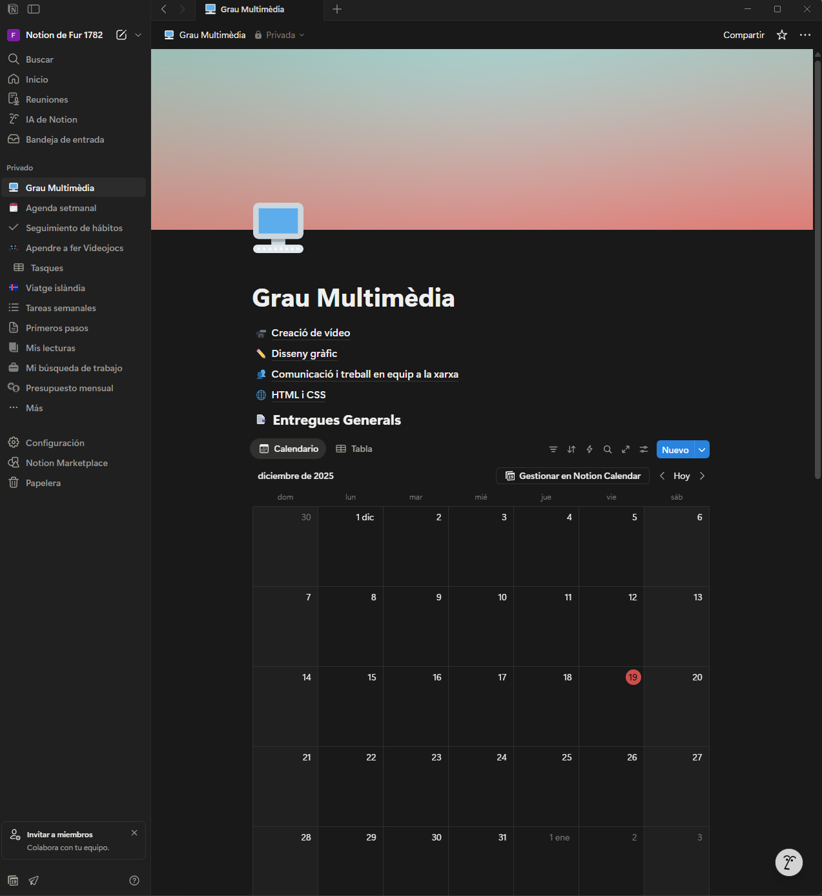

# PAC3: Cultura del Programari - Anàlisi de la Hibridació

Aquest repositori conté el treball d'anàlisi realitzat per a l'assignatura **Cultura Digital**, centrat en l'estudi de la hibridació de mitjans segons les tesis de **Lev Manovich**.

**Autor:** Agustí Rodelas Cardona

**Data:** Desembre 2025

**Grau:** Grau Multimèdia

---

## 1. Presentació del Projecte

En aquest projecte s'examinen dos casos d'estudi contemporanis —**Pokémon GO** i **Notion**— sota el prisma de l'evolució del programari. L'objectiu és identificar com aquestes eines no són simples productes multimèdia, sinó híbrids on les propietats de diferents mitjans es fusionen per crear noves lògiques culturals.

 | 

---

## 2. Casos d'Estudi

Podeu accedir a l'anàlisi detallada de cada cas a través dels següents fitxers:

| Cas d'Estudi | Conceptes Clau | Enllaç a l'Assaig |
| --- | --- | --- |
| **Pokémon GO** | Hibridació espacial, Realitat Augmentada, Crowdsourcing. | [Anàlisi Pokémon GO](assaig_pokemon.md) |
| **Notion** | Metamitjà, Modularitat, Deep Remixability, Templates. | [Anàlisi Notion](assaig_notion.md) |

---

## 3. Estructura del Repositori

L'organització d'aquest repositori segueix un model modular per facilitar-ne la lectura i navegació:

* `/imatges`: Captures de pantalla que il·lustren els conceptes d'hibridació.
* `README.md`: Guia principal del projecte (aquest fitxer).
* `assaig_pokemon.md`: Assaig sobre l'hibridació entre espai físic i dades.
* `assaig_notion.md`: Assaig sobre l'evolució de l'ofimàtica cap al metamitjà.

---

## 4. Metodologia i Eines

Aquest treball s'ha elaborat utilitzant eines que exemplifiquen els conceptes analitzats:

* **GitHub:** Com a plataforma de control de versions i cultura compartida.
* **Markdown:** Per a la redacció de documents digitals.
* **IA de suport:** S'ha utilitzat intel·ligència artificial (Gemini) com a suport en l'estructuració i correcció d'estil dels textos, sota supervisió humana.

---

## 5. Llicència

Aquest projecte està sota una llicència **Creative Commons Reconeixement 4.0 Internacional (CC BY 4.0)**, seguint els principis de cultura compartida que inspiren el repositori `CCpapers`.